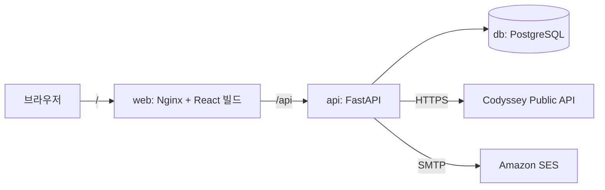
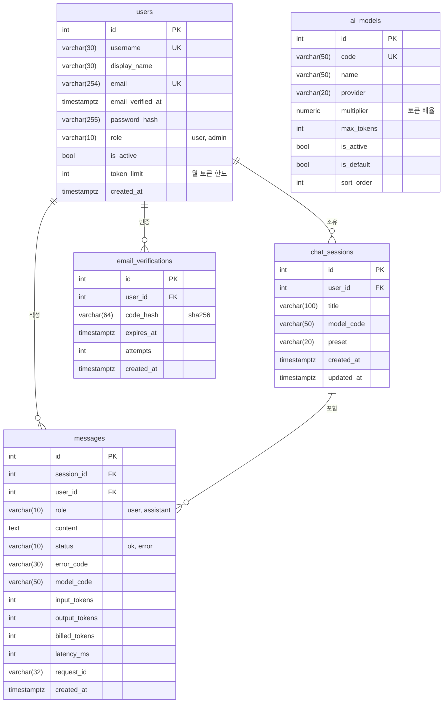

# B7-1 웹 기반 AI 챗봇 서비스

사용자 문의에 실시간으로 응답하는 AI 챗봇 서비스입니다. 로그인한 사용자가 웹 화면에서 질문하면 서버가 AI API를 호출해 응답을 생성하고, 같은 화면에 답변을 표시합니다. 질문과 답변은 PostgreSQL에 사용자별로 누적 저장되며, 같은 대화의 최근 메시지를 함께 보내 이전 질문을 이어서 물어볼 수 있습니다.

서비스 주소: https://chat.codyssey.run

## 프로젝트 개요

- 문제 정의: 프로그래밍을 공부하다 생긴 질문을 바로 물어볼 곳이 필요하고, 물어본 내용을 나중에 다시 찾아볼 수 있어야 합니다.
- 타겟 사용자: 프로그래밍을 공부하는 학습자
- 핵심 시나리오: 회원가입, 이메일 인증, 로그인, 새 대화 시작, 모델과 프리셋 선택, 질문 입력, 답변 확인, 이전 대화 이어서 질문, 내 대화 기록 조회

## 기술 스택

| 구분 | 사용 |
|---|---|
| 프론트엔드 | React, TypeScript, Vite |
| 백엔드 | Python, FastAPI, SQLAlchemy |
| DB | PostgreSQL |
| AI | Codyssey Public API (OpenAI 호환) |
| 실행 | Docker Compose, Nginx |

## 화면

### 로그인과 회원가입


회원가입 후 입력한 이메일로 6자리 인증 코드가 발송됩니다. 인증을 마치기 전에는 로그인할 수 없습니다.

### 채팅


왼쪽은 대화 목록, 오른쪽은 선택한 대화의 메시지입니다. 입력창 위에서 모델과 프리셋(학습 튜터, 코드 리뷰어, 디버깅 도우미, 개념 설명)을 선택합니다. 답변은 마크다운으로 표시되고, 메시지마다 과금 토큰 수가 표시됩니다.


AI 호출이 실패하거나 시간이 초과되면 오류 코드와 안내 문구가 대화에 함께 남습니다.


### 내 대화 기록


### 관리자


관리자는 사용자의 역할, 활성 상태, 월 토큰 한도를 변경하고, 모델의 활성 여부와 기본 모델, 토큰 배율을 설정합니다. 일별 모델 사용량과 전체 사용자의 대화 로그도 조회할 수 있습니다.

## 시스템 구조



브라우저는 `web` 컨테이너 하나에만 접속합니다. Nginx가 React 빌드 결과를 제공하고 `/api`로 시작하는 요청을 `api` 컨테이너로 전달하므로, 프론트엔드와 API가 같은 오리진을 사용합니다. 그래서 로그인 토큰을 httpOnly 쿠키로 주고받을 수 있고 CORS 설정이 필요하지 않습니다. AI API 키와 SMTP 자격 증명은 `api` 컨테이너의 환경 변수에만 있으며 브라우저로 전달되지 않습니다.

### 주요 컴포넌트 역할

| 위치 | 역할 |
|---|---|
| `frontend/` | 로그인, 회원가입, 채팅, 내 대화 기록, 관리자 화면 |
| `backend/app/routers/` | URL과 요청/응답 스키마를 연결합니다. 쿼리는 직접 작성하지 않고 `crud`와 `services`를 호출합니다 |
| `backend/app/schemas/` | Pydantic 요청/응답 모델. 입력 길이와 형식 검증을 담당합니다 |
| `backend/app/crud/` | DB 조회와 저장 함수 |
| `backend/app/services/` | AI API 호출, 채팅 처리, 사용량 계산, 이메일 인증 코드 발송 |
| `backend/app/deps.py` | 쿠키의 JWT로 현재 사용자를 확인하고, 관리자 권한을 검사합니다 |
| `backend/app/security.py` | bcrypt 비밀번호 해시, JWT 발급과 검증 |
| `backend/app/models.py` | SQLAlchemy 테이블 정의. 앱 시작 시 테이블을 생성합니다 |

## DB 구조



- 질문과 답변은 `messages`에 한 행씩 저장합니다. 질문 행은 `role=user`, 바로 다음 답변 행은 `role=assistant`입니다.
- `messages.user_id`는 `chat_sessions`를 거치지 않고 사용자 기준으로 바로 조회하기 위해 둡니다. `(user_id, created_at)`, `(session_id, created_at)` 인덱스가 있습니다.
- 사용자나 대화를 삭제하면 하위 대화와 메시지가 외래 키의 `ON DELETE CASCADE`로 함께 삭제됩니다.
- `ai_models`는 선택 가능한 모델 목록입니다. `chat_sessions.model_code`와 `messages.model_code`는 `ai_models.code` 값을 저장하지만 외래 키는 두지 않았습니다. 관리자가 모델을 비활성화해도 지난 대화 기록은 그대로 남아야 하기 때문입니다.
- 이메일 인증 코드는 원문 대신 sha256 해시로 저장합니다. 코드는 10분 동안 유효하고, 5회 틀리면 무효가 됩니다. 재발송하면 이전 코드는 삭제됩니다.
- 이미 운영 중인 DB에는 API 시작 시 `display_name`, `email`, `email_verified_at` 컬럼을 추가합니다. 기존 사용자는 이메일 인증을 마친 상태로 처리하며, 컬럼이 이미 있으면 테이블을 변경하지 않습니다.

## 대화 로그 저장과 조회

질문과 답변을 DB에 저장하는 이유는 세 가지입니다.

- 문맥 유지: 같은 대화의 최근 `CONTEXT_WINDOW`개 메시지를 DB에서 읽어 AI 요청에 함께 보냅니다. 서버 메모리에 대화를 들고 있지 않으므로 API를 다시 시작해도 대화를 이어갈 수 있습니다.
- 사용자 기준 추적: 모든 메시지에 `user_id`와 `created_at`이 있어 사용자별, 기간별로 조회할 수 있습니다. AI 호출이 실패한 경우에도 질문과 `status=error`, `error_code`가 남으므로 어떤 요청이 왜 실패했는지 확인할 수 있습니다.
- 사용량 제한: 이번 달(KST 기준) `billed_tokens` 합계를 `users.token_limit`과 비교해 한도를 넘으면 요청을 차단합니다.

### SQL로 확인하기

`scripts/check_logs.sql`에는 사용자별 최근 대화 5건과, 사용자별 질문 수, 오류 수, 토큰 합계를 조회하는 쿼리가 있습니다. 답변이 저장되지 않은 질문은 `status`가 `error`로 표시됩니다.

```bash
docker compose exec -T db sh -c 'psql -U "$POSTGRES_USER" -d "$POSTGRES_DB"' < scripts/check_logs.sql
```

### API로 확인하기

로그인하면 받은 `access_token` 쿠키로 내 대화 기록을 조회합니다. `limit`(1~100, 기본 50)과 `offset`으로 페이지를 나눕니다.

```bash
curl -s -c cookies.txt -H 'Content-Type: application/json' \
  -d '{"username":"<아이디>","password":"<비밀번호>"}' https://chat.codyssey.run/api/auth/login
curl -s -b cookies.txt 'https://chat.codyssey.run/api/me/chats?limit=5'
```

관리자 계정은 전체 사용자의 대화를 조회할 수 있고, `user_id`로 특정 사용자만 조회할 수 있습니다. 응답 항목에는 `username`과 `display_name`이 추가됩니다.

```bash
curl -s -b admin-cookies.txt 'https://chat.codyssey.run/api/admin/chats?user_id=2&limit=5'
```

같은 내용은 웹 화면의 내 대화 기록(`/logs`)과 관리자 화면의 대화 로그 탭에서도 확인할 수 있습니다.

## 팀 구성

| 이름 | GitHub | 역할 |
|---|---|---|
| 신예준 | pnuece | 백엔드 AI 연동 |
| 정세영 | JeongSeYoung | 백엔드 인증, 세션, DB |
| 김희성 | Logan-kim-the-philosopher | 프론트엔드 |

## 브랜치 전략

- `main`: 배포 기준 브랜치
- `develop`: 기능을 모으는 브랜치
- `feature/<기능>`: 기능 단위 작업 브랜치. `develop`으로 PR을 열고 리뷰 후 병합합니다.
